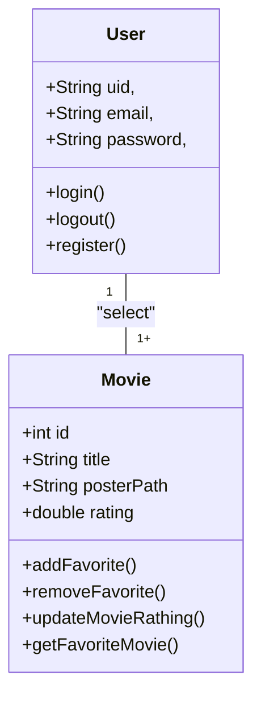
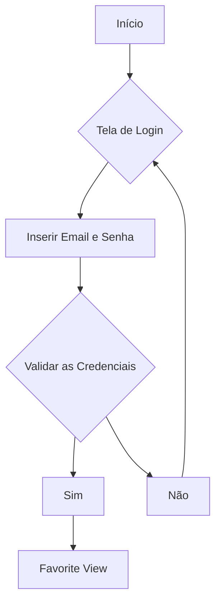

# CineFavorite (Formativa)

## Briefing
Construir um Aplicativo do Zero - O CineFavorite que permitirá criar uma conte e buscar filmes em uma API, montar uma galeria pessoal de filmes favoritos, com poster(capa) e nota avaliativa do usuário para o filme.

## 🚀 Objetivo
- Criar uma Galeria Personalizada por Usuário de Filmes Favoritos
- Buscar Filmes em uma API e Listar para selecionar filmes favoritos
- Criação de Contas por Usuário
- Listar filmes por palavra-chave

## Levantamento de Requisitos
- ### 🧩 Funcionais
- ✅ RF01: Registro de usuário com e-mail e senha.
- ✅ RF02: Login de usuário autenticado.
- ✅ RF03: Logout do sistema.
- ✅ RF04: Busca de filmes por palavra-chave via API TMDB.
- ✅ RF05: Listagem de filmes com título e poster.
- ✅ RF06: Adicionar filmes aos favoritos.
- ✅ RF07: Remover filmes dos favoritos.
- ✅ RF08: Avaliar filme com nota personalizada.
- ✅ RF09: Exibir galeria de filmes favoritos do usuário.
- ✅ RF10: Atualizar nota de avaliação de um filme salvo.

- ### 🔒 Não Funcionais
- ✅ RNF01: Plataforma responsiva (Android / iOS).
- ✅ RNF02: Interface intuitiva baseada em protótipo Figma.
- ✅ RNF03: Armazenamento seguro com Firestore DB.
- ✅ RNF04: Autenticação segura com Firebase Authentication.
- ✅ RNF05: Integração com API externa (TMDB).
- ✅ RNF06: Versionamento do código via GitHub.
- ✅ RNF07: Baixo tempo de resposta (até 2s em interações).
- ✅ RNF08: Persistência de sessão (manter usuário logado).


##  🛠️ Recursos do Projeto
- Linguagem de programação: Flutter/Dart
- API TMDB: Base de dados para Filmes
- Figma: Prototipagem
- GitHub: Para Armazenamento e Versionamento do Código
- FireBase: Authentication/ FireStore DB
- VsCode: Codificação / Teste 

## Diagramas
1. ### Classe:
Demostrar o Funcionamento Das Entidades do Sistema
- Usuário (User): Classe já modelada pelo FireBaseAuth
      - Atributos: email, senha, uid
      - Métodos: login, registrar, logout
- Filmes Fvaoritos (Movie): Classe Modelada pelo DEV - Baseada na API TMDB
     - Atributos: id, título, PosterPath, Nota
     - Métodos: adicionar, remover, listar, atualizarNota (CRUD)


2. ### Uso
Ação que os Atores Podem Fazer
- Usuário:
      - Registrar
      - Login
      - Logout
      - Procurar Filmes na API
      - Salvar Filmes aos Favoritos
      - Dar Nota aos Filmes Favoritos
      - Remove Filmes dos Favoritos

```mermaid

graph TD
   subgraph "Ações"~
     ac1([Registrar])
     ac2([Login])
     ac3([Logout])
     ac4([SearchMovies])
     ac5([AddFavoriteMovies])
     ac6([UpdateMovieRsating])
     ac7([RemoveFavoriteMovie])
  end

  user([Usuário])

  user --> ac1   
  user --> ac2

  ac1 --> ac2   
  ac2 --> ac3   
  ac2 --> ac4   
  ac2 --> ac4   
  ac2 --> ac6   
  ac2 --> ac7   

```

3. ###  🔄 Fluxo
Determinar o Caminho Percorrido pelo Ator Para Executar uma Ação

- Fluxo de Ação de Login



## Prototipagem

Link dos Protótipos: https://www.figma.com/design/NeCrbzn9ToTkVg3M8OYx0h/Untitled?node-id=2-13&t=KMsLqmQ6IGgZW3uf-1
